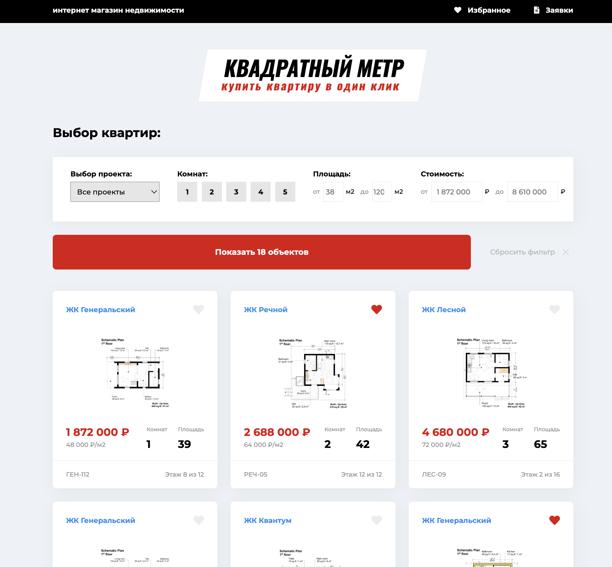
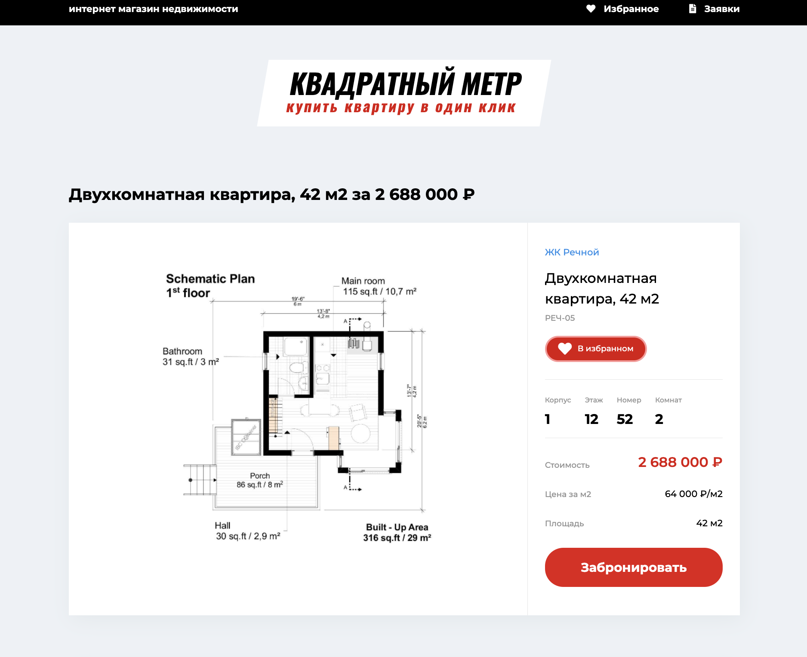
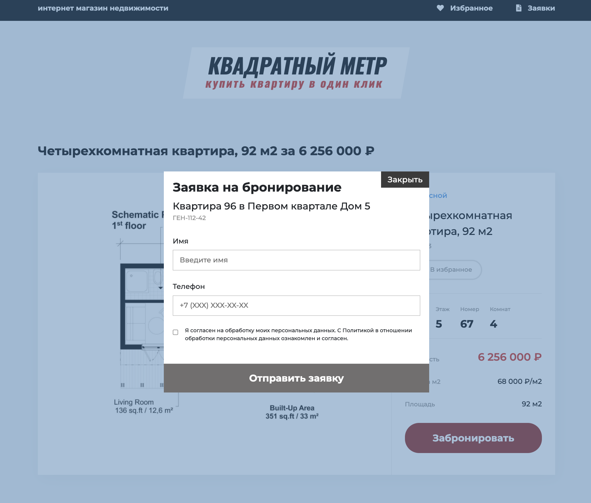

#  Приложение каталог квартир "Квадратный метр" в рамках обучения на курсе "JavaScript разработчик 2020" от Webcademy

## Описание проекта
Страницы:
- Главная страница
- Детальная страница квартиры
- Список избранного
- Список заявок
- Модальное окно бронирования

Функциональность:
- Просмотр списка квартир
- Фильтрация квартир по параметрам (с динамическим выводом минимальной и максимальной площади и стоимости в зависимости от имеющихся данных)
- Добавление / удаление из избранного. Просмотр списка избранного
- Возможность создать заявку на бронирование квартиры






## Установка

Сборка проекта с помощью webpack:

```sh
npm -i webpack webpack-cli webpack-dev-server htmp-webpack-plugin --save-dev
```

```sh
# запустить проект на ebpack-dev-server
npm run start

# запустить проект
npm run build  
```